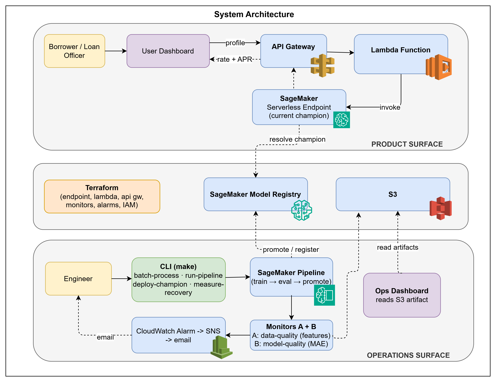
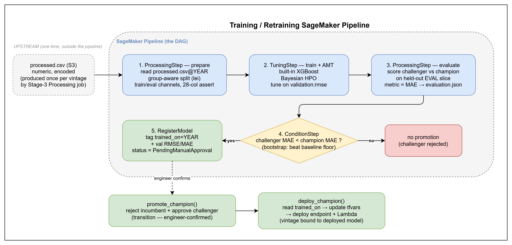
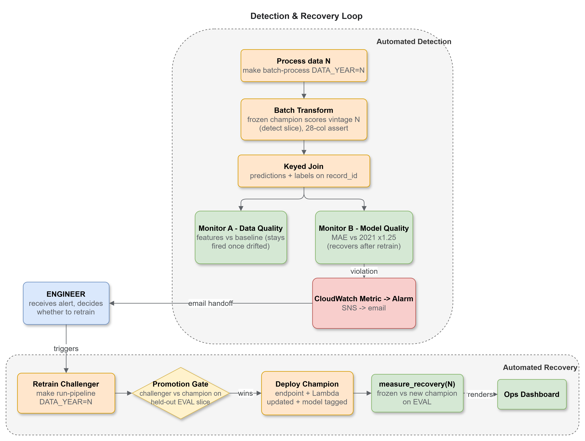

# loan_rate_predictor

AWS-managed MLOps project predicting mortgage `rate_spread` (APR - APOR) on Arizona HMDA data (2021-2024).

Two surfaces: a **synchronous pricing API** (borrower gets a rate estimate) and an **ops CLI** (engineer keeps the estimate accurate as the market moves).

**Pricing UI:** https://jean-johnson-zwix.github.io/loan_rate_predictor/user-dashboard/

**Ops Dashboard:** https://jean-johnson-zwix.github.io/loan_rate_predictor/ops-dashboard/


## Stack

| Layer | Choice |
|---|---|
| Model | SageMaker built-in XGBoost |
| Tuning | SageMaker AMT (Bayesian) |
| Registry | SageMaker Model Registry |
| Experiment tracking | SageMaker managed MLflow |
| Monitoring | Evidently (data drift + model quality) |
| Alerting | CloudWatch alarms + SNS |
| Infra | Terraform |



## Prerequisites

- Python 3.11+
- Terraform >= 1.6
- AWS CLI with profile `loan-rate-predictor-local-developer`
- `.env` file with `STORAGE_BUCKET_NAME`, `SAGEMAKER_ROLE_ARN`, and `MLFLOW_TRACKING_ARN`

## Command Reference

### Setup

```bash
make data                            # download AZ HMDA CSVs -> data/raw/
make upload-raw                      # sync data/raw/ -> S3
make tf-init                         # bootstrap Terraform (once)
make tf-apply                        # deploy infra (endpoint, alerts, MLflow server)
```

### Data Processing

```bash
make preprocess                      # run locally (set WINSORIZE_YEAR for per-vintage bounds)
make run-preprocessing               # submit Processing job to SageMaker
```

`preprocess` loads all years from `data/raw/`, applies filters, coerces types, engineers features (DTI ordinal + categorical encoding), winsorizes `rate_spread` at the specified year's 1st/99th percentile, and writes `processed.csv` + `categorical_encodings.json`.

### Training



```bash
make run-pipeline DATA_YEAR=2021     # start SageMaker Pipeline (async)
```

Pipeline: `Prepare` (GroupShuffleSplit on `lei`) -> `TrainAMT` (20 Bayesian trials, XGBoost) -> `Evaluate` (challenger vs champion on val set) -> `Register` (if challenger wins). Model registered as `PendingManualApproval`.

### Monitoring

```bash
make monitor YEAR=2022               # score -> join -> Evidently reports -> CloudWatch -> SNS
```

Scores the full year with the current champion via batch transform, joins predictions with ground-truth labels, then runs Evidently `DataDriftPreset` (feature distributions vs champion's training year) and `RegressionPreset` (MAE/RMSE/R2). Publishes custom CloudWatch metrics; alarms fire SNS email if MAE exceeds baseline x 1.25.

### Retraining



```bash
make retrain DATA_YEAR=2023          # start pipeline (async)
# wait for pipeline to succeed...
make evaluate-retrain DATA_YEAR=2023 # promote -> deploy -> measure recovery
```

`retrain` starts the pipeline for a new year. `evaluate-retrain` runs post-pipeline: reads evaluation metrics from the pipeline output, registers the model in MLflow, sets the `champion` alias, updates `terraform.auto.tfvars`, deploys the endpoint, and measures recovery on the held-out eval slice (same `split_group_aware` split the pipeline trained with).

### Pricing API

```bash
make package-lambda                  # build dist/pricing_lambda.zip
make deploy-champion                 # promote -> update tfvars -> tf-apply
make invoke                          # send sample payload to endpoint
```

`POST /price` takes a JSON borrower profile, applies frozen transforms (DTI ordinal + categorical label encoding, 28-column contract assertion), invokes the serverless endpoint, adds APOR back for an indicative APR, and returns `{ rate_spread, indicative_apr, trained_on }`.

### Ops Dashboard

```bash
make ops-report                      # generate ui/ops-dashboard/ops-data.json + download Evidently reports
```

Reads model versions from MLflow, monitoring metrics from Evidently `report.json`, and recovery data from `recovery/{year}.json` on S3. Downloads Evidently HTML reports to `ui/ops-dashboard/reports/`. Outputs `ops-data.json` consumed by the static dashboard.

## Model Metrics

| Champion | Trained On | Val MAE | Val RMSE | Recovery |
|----------|-----------|---------|----------|----------|
| v1 | HMDA 2021 | 0.248 | 0.339 | baseline |
| v2 | HMDA 2022 | 0.423 | -- | +0.086 (17%) |
| v3 | HMDA 2023 | 0.546 | -- | +0.090 (14%) |

Absolute MAE rises across vintages (target std grew 50%: 0.61 -> 0.90). Recovery is gap-closed vs frozen champion on held-out eval slice, not return to baseline. 28 features, Bayesian AMT, group-split on lender (`lei`).

## Serving

| Workload | Mode |
|----------|------|
| Year scoring (ops) | Batch transform |
| Single prediction (pricing) | Lambda -> serverless endpoint |
